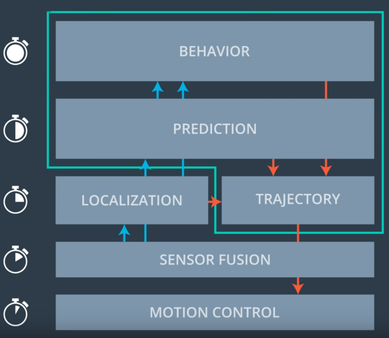
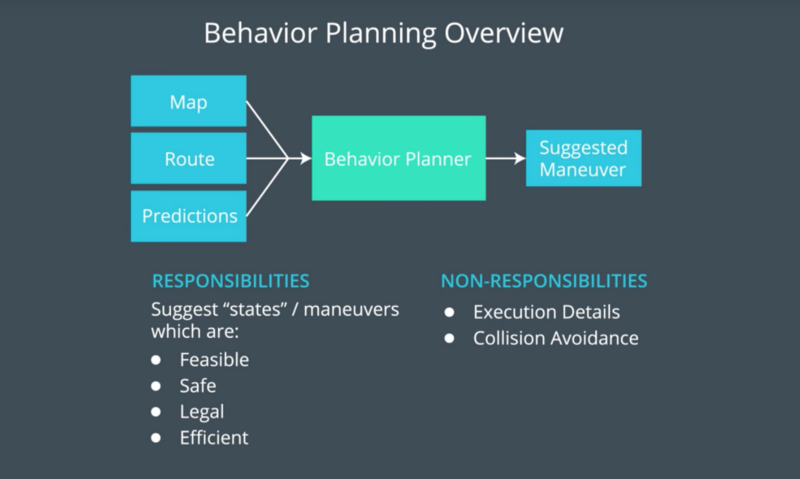
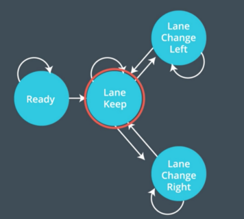

# Path Planning for self driving cars

In this project the goal is to safely navigate around a virtual highway with other traffic that is driving +-10 MPH of the 50 MPH speed limit. You will be provided the car's localization and sensor fusion data, there is also a sparse map list of waypoints around the highway. The car should try to go as close as possible to the 50 MPH speed limit, which means passing slower traffic when possible, note that other cars will try to change lanes too. The car should avoid hitting other cars at all cost as well as driving inside of the marked road lanes at all times, unless going from one lane to another. The car should be able to make one complete loop around the 6946m highway. Since the car is trying to go 50 MPH, it should take a little over 5 minutes to complete 1 loop. Also the car should not experience total acceleration over 10 m/s^2 and jerk that is greater than 10 m/s^3.  
This project is done as part of Self-Driving Car Engineer Nanodegree Program.


## Dependencies

* cmake >= 3.5
  * All OSes: [click here for installation instructions](https://cmake.org/install/)
* make >= 4.1
  * Linux: make is installed by default on most Linux distros
  * Mac: [install Xcode command line tools to get make](https://developer.apple.com/xcode/features/)
  * Windows: [Click here for installation instructions](http://gnuwin32.sourceforge.net/packages/make.htm)
* gcc/g++ >= 5.4
  * Linux: gcc / g++ is installed by default on most Linux distros
  * Mac: same deal as make - [install Xcode command line tools]((https://developer.apple.com/xcode/features/)
  * Windows: recommend using [MinGW](http://www.mingw.org/)
* [uWebSockets](https://github.com/uWebSockets/uWebSockets)
  * Run either `install-mac.sh` or `install-ubuntu.sh`.
  * If you install from source, checkout to commit `e94b6e1`, i.e.
    ```
    git clone https://github.com/uWebSockets/uWebSockets 
    cd uWebSockets
    git checkout e94b6e1
    ```
* This project involves the Term3 Simulator which can be downloaded from [here](https://github.com/udacity/self-driving-car-sim/releases/tag/T3_v1.2).

---

## Running the Code
Once the install for uWebSocketIO is complete, the main program can be built and ran by doing the following from the project top directory.

1. Make a build directory : `mkdir build && cd build`
2. Compile : `cmake .. && make`
3. Run it : `./particle_filter`

Alternatively some scripts have been included to streamline this process, these can be leveraged by executing the following in the top directory of the project:

1. `./clean.sh`
2. `./build.sh`
3. `./run.sh`

**Here is the data provided from the Simulator to the Path planning C++ Program.**

#### Main car's localization Data (No Noise)

["x"] The car's x position in map coordinates

["y"] The car's y position in map coordinates

["s"] The car's s position in frenet coordinates

["d"] The car's d position in frenet coordinates

["yaw"] The car's yaw angle in the map

["speed"] The car's speed in MPH

#### Previous path data given to the Planner

//Note: Return the previous list but with processed points removed, can be a nice tool to show how far along
the path has processed since last time. 

["previous_path_x"] The previous list of x points previously given to the simulator

["previous_path_y"] The previous list of y points previously given to the simulator

#### Previous path's end s and d values 

["end_path_s"] The previous list's last point's frenet s value

["end_path_d"] The previous list's last point's frenet d value

#### Sensor Fusion Data, a list of all other car's attributes on the same side of the road. (No Noise)

["sensor_fusion"] A 2d vector of cars and then that car's [car's unique ID, car's x position in map coordinates, car's y position in map coordinates, car's x velocity in m/s, car's y velocity in m/s, car's s position in frenet coordinates, car's d position in frenet coordinates. 

---

## Details

1. The car uses a perfect controller and will visit every (x,y) point it recieves in the list every .02 seconds. The units for the (x,y) points are in meters and the spacing of the points determines the speed of the car. The vector going from a point to the next point in the list dictates the angle of the car. Acceleration both in the tangential and normal directions is measured along with the jerk, the rate of change of total Acceleration. The (x,y) point paths that the planner recieves should not have a total acceleration that goes over 10 m/s^2, also the jerk should not go over 50 m/s^3. (NOTE: As this is BETA, these requirements might change. Also currently jerk is over a .02 second interval, it would probably be better to average total acceleration over 1 second and measure jerk from that.

2. There will be some latency between the simulator running and the path planner returning a path, with optimized code usually its not very long maybe just 1-3 time steps. During this delay the simulator will continue using points that it was last given, because of this its a good idea to store the last points you have used so you can have a smooth transition. previous_path_x, and previous_path_y can be helpful for this transition since they show the last points given to the simulator controller with the processed points already removed. You would either return a path that extends this previous path or make sure to create a new path that has a smooth transition with this last path.

#### The map of the highway is in data/highway_map.txt
Each waypoint in the list contains  [x,y,s,dx,dy] values. x and y are the waypoint's map coordinate position, the s value is the distance along the road to get to that waypoint in meters, the dx and dy values define the unit normal vector pointing outward of the highway loop.

The highway's waypoints loop around so the frenet s value, distance along the road, goes from 0 to 6945.554.

---

## Path planning
Path ​planning ​​routes ​​a ​​vehicle ​from ​​one ​​point ​​to ​another, ​and ​it ​​handles ​​how ​​to ​react ​emergencies arise.The major components of the path planning module are prediction , behavioral planning and trajectory generation.  
 

### 1. Prediction
The prediction component estimates what states other objects are likely to be in the future. For example, if another vehicle were identified, the prediction component would estimate its future trajectory.There are different approaches to prediction.There are data-driven and model-based approaches.In this highway driving project , a simple approach has been adopted.  
There are set of flags that are set according to the sensor fusion data.
```
bool car_is_front = false;
bool car_is_right = false;
bool car_is_left = false;

```     
Which lanes the surrounding vehicles are located are found by this method in car.cpp , assuming we have only three lanes and each lane has 4 meter width. 
```
void Car::determine_lane()
{
    if((this->d > 0) && (this->d < 4))
    {   
        this->lane = 0;
    }
    else if((this->d > 4) && (this->d < 8))
    {   
        this->lane = 1;
    }
    else if((this->d > 8) && (this->d < 12))
    {   
        this->lane = 2;
    }
}
```
Predicting where the vehicles will be in the future 
```
double predicted_s = other_car.s;
				
predicted_s += (double)0.02*prev_size*other_car.speed;
```
The flags are set to `true` or `false` based on the predicted location of other vehicles with respect to the ego vehicle.
```
if(other_car.lane == car_lane)
{
  //if a vehicle in the same lane and in 30 meter range
  car_is_front |= (predicted_s > car_s) && (predicted_s - car_s < 30);
}

else if(other_car.lane - car_lane == 1)
{
  //if a vehicle is on the right lane and in 30 meter range 
  car_is_right |= fabs(predicted_s - car_s) < 30;
}

else if(other_car.lane - car_lane == -1 )
{
  //if a vehicle is on the left lane and in 30 meter range
  car_is_left |= fabs(predicted_s - car_s) < 30;
}
```
### 2. Behavioral planning
The behavioral planning component determines what maneuver the car should take at anytime such as Keep lane , change lane right , change lane left , accelerate .. etc.



The behavioral planner accepts inputs from the prediction module and uses a finite state machine to set the next state of the ego vehicle .In this highway driving example , we have only three states `kL` , `CLR` , `CLL`.



```
if(car_is_front)
{
    if( (car_lane >0) && (!car_is_left) )
    {
      car_lane--;
    }

    else if( (car_lane !=2) && (!car_is_right) )
    {
      car_lane++;
    }

    else
    {
      ref_velocity -= 2*velocity_increment;
    }
}

else if(ref_velocity < max_velocity)
{
  
    ref_velocity += velocity_increment;
  
}

```

As long as the the ego vehicle speed is slower than the speed limit , It will keep accelerating by a small amount so as not to exceed the total acceleration of 10 m/s^2 and the maximum allowed jerk of 10 m/s^3 until it reaches a speed slightly lower than the speed limit.The ego vehicle  is able to smoothly change lanes when it makes sense to do so, such as when behind a slower moving vehicle and an adjacent lane is clear of other traffic and if it's obstructed by slower vehicle ahead of it and it's not able to change lanes right or left , it will decelerate slowly to avoid collision.

### 3. Trajectory planning
Based on the suggested maneuver , the trajectory planning determines the best trajectory to realize this maneuver.
Trajectory planning code is inspired from the udacity project code walk through.  
First,find any previous path points if they are exist and add them to the trajectory. 

```
int prev_size = previous_path_x.size();

if(prev_size < 2)
{
    //use two points that makes path tangent to the car

    double prev_car_x = car_x - cos(car_yaw);
    double prev_car_y = car_y - sin(car_yaw);

    ptsx.push_back(prev_car_x);
    ptsx.push_back(car_x);

    ptsy.push_back(prev_car_y);
    ptsy.push_back(car_y);
}

else
{
    //redefine the reference point to the last point of the previous path

    ref_x = previous_path_x[prev_size-1];
    ref_y = previous_path_y[prev_size-1];

    double prev_ref_x = previous_path_x[prev_size-2];
    double prev_ref_y = previous_path_y[prev_size-2];

    ref_yaw = atan2(ref_y - prev_ref_y , ref_x - prev_ref_x);

    ptsx.push_back(prev_ref_x);
    ptsx.push_back(ref_x);

    ptsy.push_back(prev_ref_y);
    ptsy.push_back(ref_y);
}	

```
Now we need to add 3 future target points to ptsx, ptsy vectors so that each vector has 5 points in total

```
vector<double> next_wp0 = getXY(car_s+30 , 2+4*car_lane , map_waypoints_s , map_waypoints_x ,map_waypoints_y);
vector<double> next_wp1 = getXY(car_s+60 , 2+4*car_lane , map_waypoints_s , map_waypoints_x ,map_waypoints_y);
vector<double> next_wp2 = getXY(car_s+90 , 2+4*car_lane , map_waypoints_s , map_waypoints_x ,map_waypoints_y);

ptsx.push_back(next_wp0[0]);
ptsx.push_back(next_wp1[0]);
ptsx.push_back(next_wp2[0]);

ptsy.push_back(next_wp0[1]);
ptsy.push_back(next_wp1[1]);
ptsy.push_back(next_wp2[1]);

```
For trajectory generation, spline is used  instead of polynomial trajectory generation because it is simple to use and requiring no dependencies as it is one header file.

```
tk::spline trajectory;
trajectory.set_points(ptsx,ptsy);

```

To have a smooth transition , previous path points are add.

```
for(unsigned int i=0; i<prev_size ; i++)
{
  next_x_vals.push_back(previous_path_x[i]);
  next_y_vals.push_back(previous_path_y[i]);
}

```
Now we need to sample the spline trajectory till the horizon value , in this case 30 m , so that the spacing between points we get makes the ego vehicle travel at the desired speed.Remember the spacing between path points determines the speed of the vehicle.we add the new points to the previously added path points to `next_x_vals` and `next_y_vals` vectors to have 50 points in total.

```
double target_x = 30.0;                   // 30 meter ahead
double target_y = trajectory(target_x);
double target_distance = sqrt(target_x*target_x + target_y*target_y);

double x_add_on = 0;

for(unsigned int i=1 ; i<50 - prev_size ; i++)
{
  double num_points = target_distance/(0.02*ref_velocity/2.24);
  double x_point = x_add_on + target_x/num_points;
  double y_point = trajectory(x_point);

  x_add_on = x_point;

  double x_ref = x_point;
  double y_ref = y_point;

  //restore it back into the map coordinates

  x_point = x_ref * cos(ref_yaw) - y_ref * sin(ref_yaw);
  y_point = x_ref * sin(ref_yaw) + y_ref * cos(ref_yaw);

  x_point += ref_x;
  y_point += ref_y;


  next_x_vals.push_back(x_point);
  next_y_vals.push_back(y_point);


} 

```
Finally , `next_x_vals` and `next_y_vals` vectors containing the x,y coordinates of the trajectory which the ego vehicle should follow are sent to the simulator.

```
json msgJson;

msgJson["next_x"] = next_x_vals;
msgJson["next_y"] = next_y_vals;

```

## Tips

A really helpful resource for doing this project and creating smooth trajectories was using http://kluge.in-chemnitz.de/opensource/spline/, the spline function is in a single hearder file is really easy to use.

---
